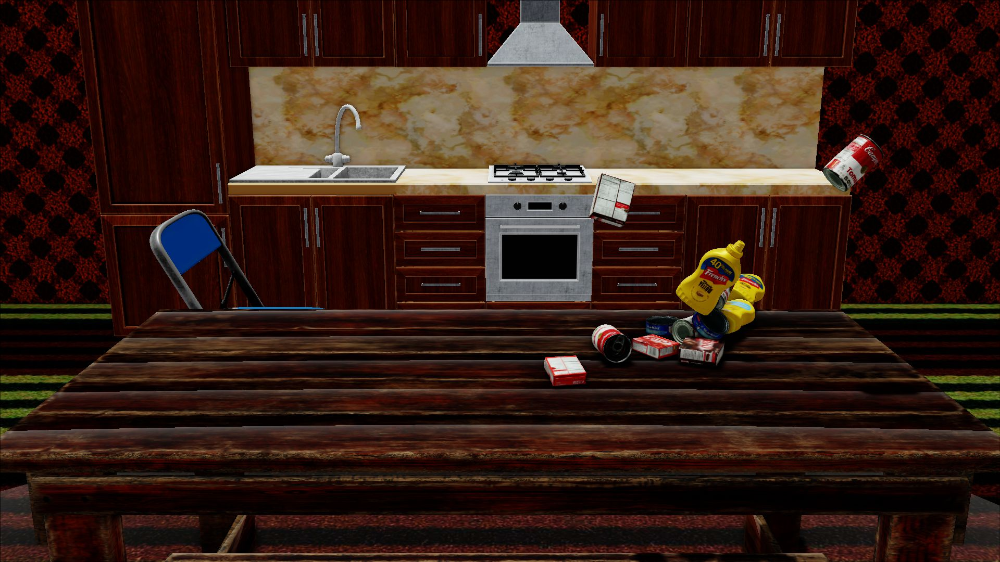
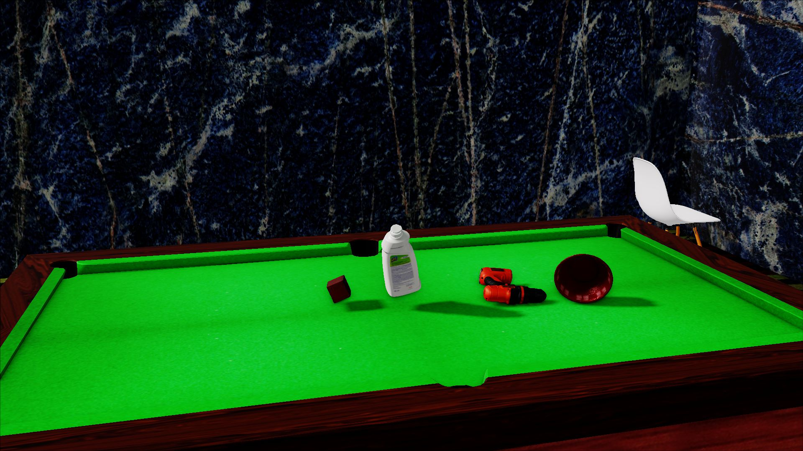
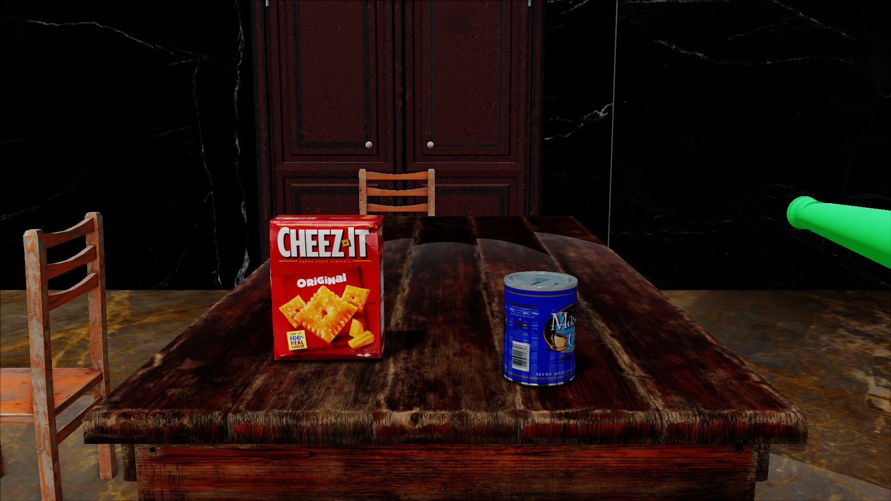
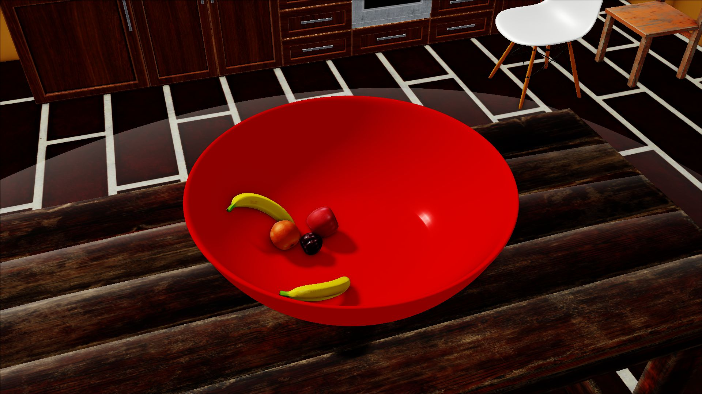
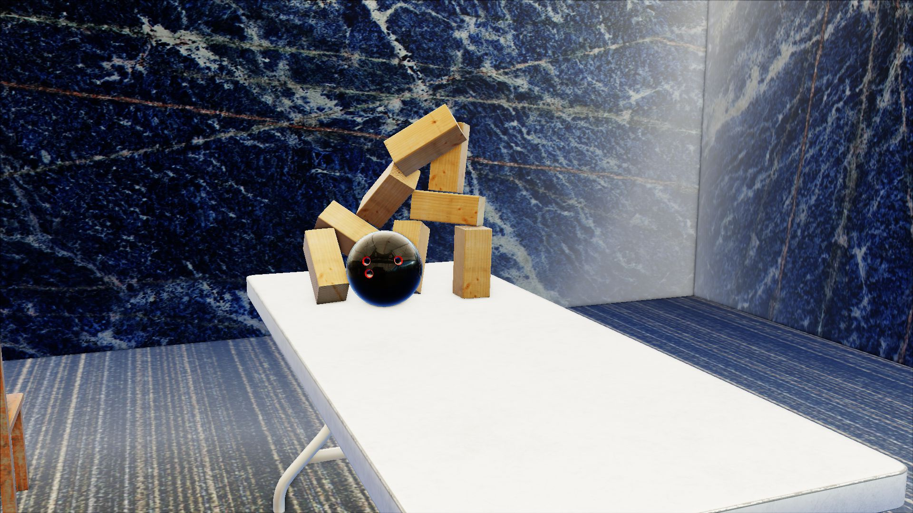
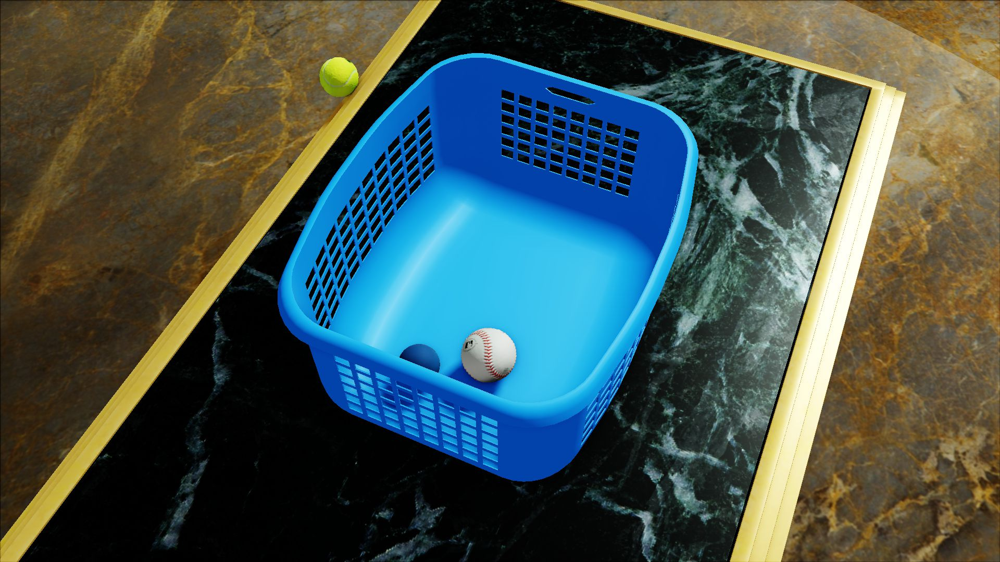

# SL-Cutscenes

`sl-cutscenes` is an easy-to-use extension framework for [`stillleben`](https://github.com/AIS-Bonn/stillleben) 
that generates realistic and visually diverse indoor scenes with physically interacting objects. With the help of `stillleben`, these scenes come 
in hi-res RGBD (stereo) frame sequences with dense semantic annotations (object classes/poses, instances, camera information, ...). 
This way, creating visually diverse video datasets for Computer Vision and Robotics becomes a piece of cake!

### Examples

<b>A collapsing stack of objects</b>

<b>Household items falling onto a pool table</b>

<b>Items about to be swept away by a robotic arm</b>

<b>Fruits falling into a big bowl</b>

<b>Bowling ball crashing into wooden blocks</b>

<b>Balls falling into a laundry basket</b>

### Installation

`stillleben` needs a custom installation due to special package requirements, so `sl-cutscenes` needs the 
following prerequisites:
- `python>3.6`
- `conda`
- `bash`

For installation, executing the following steps:

1. Create a new conda environment with `python>3.6` and switch to the new environment. 
2. Install `stillleben` as shown [here](https://ais-bonn.github.io/stillleben/installation.html).
3. Clone this repo to wherever you want and `cd` into it.
4. Download the external asset data from [here](https://uni-bonn.sciebo.de/s/Bk9o0sctQmFcddI) 
   and unpack it into `sl_cutscenes/assets/external_data`.
5. Install the remaining dependencies and the package: `pip install .`.

### Usage

`sl-cutscenes` provides access to a variety of so-called "scenarios". 
These scenarios are object setups that lead to different physical interactions between them, 
`sl-cutscenes` comes with a wide variety of configuration options for the scenarios.

Generating scenes is done by running `main.py`, e.g.:

- `python main.py --scenario all --cameras 2` simulates each scenario once and renders the annotated video from 2 camera perspectives.
- `python main.py --scenario bowl --frames 90 --assemble-rgb` simulates the `bowl` scenario once and until 90 frames have been produced, and additionally creates a video file from the rendered frames.
- `python main.py --scenario throw --iterations 3 --coplanar-stereo --sim-steps-per-frame 10` simulates the `throw` scenario three times with half the number of steps per frame (resulting in doubled fps) and captures it with a coplanar stereo camera.
- `python main.py -h` Shows you the detailed argparse description of the different configuration options 
that can be controlled with optional arguments.
  
The generated data will be available in a time-stamped subfolder of the `out` directory of the repository.

### Acknowledgements

- The folder containing the object and texture data (downloadable from [here](https://cloud.vi.cs.uni-bonn.de/index.php/s/7isFbJWaeBLB74Y)) also contains an ACKNOWLEDGEMENT file for all acknowledgements regarding the used assets.
- We'd like to thank [Max Schwarz](https://github.com/xqms) for insights and supportive development on [stillleben](https://ais-bonn.github.io/stillleben) to make this framework happen.

### Citing

Please consider citing if you find our repository helpful (see "Cite this repository" in the repository's about section on github.)

### License

This project is subject to an MIT License, see the LICENSE file.